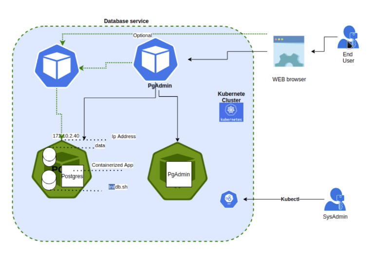

# SECCIÓN DE PRACTICAS Y EJERCICIOS

# Creacion de POD: Prueba con imagen billingapp

1. Tener imagen dockerisada: <https://hub.docker.com/r/sotobotero/udemy-devops/tags>
2. Recomiendan tener solo el docker de minikube `docker ps -a`
3. crear pod: `kubectl run nombre_cualquiera -- image=url-imagen --port=puerto1 puerto2`
    - puerto1 = puerto expuesto a internet (externo)
    - puerto2 = puerto expuesto dentro del Pod
    - `kubectl run kbillingapp --image=sotobotero/udemy-devops:0.0.1 --port=80 80`
4. Salida de la consola: *pod/kbillingapp created*
5. Comprobar pod:
    - por dashboard: Pods : kbillingapp
    - por kubectl: `kubectl get pods`
        - detalles: `kubectl describe pod kbillingapp`
6. Exponer servicio
    - kbillingapp: Es el nombre del pod
    - Tipo: Applicación de tipo Load Balancer
    - Port: Puerto expuesto a internet (exte no será el puerto por donde se accede)
    - Target-port: Puerto del cluster
    - Exponer con: `kubectl expose pod kbillingapp --type=LoadBalancer --port=8080 --target-port=80`
    - Salida de la consola: *service/kbillingapp exposed*
    - Comprobar: `kubectl get services` \\ Debe estar kbillingapp
7. Ver servicio: `kubectl describe service kbillingapp`
    - Ahora se tiene un pod llamado *kbillingapp* y un servicio llamado *kbillingapp*
    - En dashboard de minikube tambien se ve el servicio
8. Acceder a la aplicación: `minikube service --url kbillingapp`
    - resultado: <http://192.168.49.2:30777>
9. Ver logs:
    - Desde dashboard de minikube: *Pods > nombre-del-pod >> Logs*
    - Desde Terminal: `kubectl logs kbillingapp`

# 7 PRACTICA Cluester y Pods

Servicio en cluster de kubernetes que tiene una BD (postgresql) y un administrador de BD web. El usuario final puede conectarse al motor de la BD con otro cliente. Se va a definir un *deployment* para la creación de los Pods de Postgres y PgAdmin.

Para el acceso desde internet se usaran dos servicios: PgAdmin y Posgres los cuales son accesibles desde el WEB Browser.


## Arquitectura

Cluester conformado por dos pods, cada uno para la BD y otro para la aplicación. Se montará un servicio de acceso remoto o local para la administración de los pods.

1. Servicio Posgre: Servicio para administra la BD
2. Servicio PgAdmin: Servicio web que permite administrar la BD
3. Pod Postgres
    - Imagen de postgres
    - Volumen para almacenar datos
    - Segundo volumen para ejecutar scripts
4. Pod PgAdmin
    - Aplicación web




## Creación ficheros de configuración

### Archivos

1. Crear *secret-dev.yaml* para el pod de Postgres
    - para guardar de manera segura contraseñas e información que debe ser cifrada
    - dev es para indicar que es desarrollo
    - agregar datos de la bd cifradas con base64:
        - DB: postgres -> cG9zdGdyZXM=
        - U: postgres -> cG9zdGdyZXM=
        - P: qwerty -> cXdlcnR5
2. Crear *secret-pgadmin.yaml* para el pod de PgAdmin
    - para guardar de manera segura contraseñas e información que debe ser cifrada
    - pgadmin es para indicar que es para el pod de pgadmin
    - agregar datos para pgamin cifradas con base64:
        - PGADMIN_DEFAULT_EMAIL: admin@admin.com -> YWRtaW5AYWRtaW4uY29t
        - PGADMIN_DEFAULT_PASSWORD: qwerty -> cXdlcnR5
        - PGADMIN_PORT: 80 -> ODA=
3. Crear *persistence-volume.yaml* para el almacenamiento persistente
    - para definir las propiedades del amlmacenamiento que en este caso es persistente
4. Crear *persistence-volume-claim.yaml* para definir como son las peticiones que debe hacer una aplicación para usar el almacenamiento
    - agregar en *data* todos los permisos, tambien agregar permisos del schema por probeblmas anteriores dados en las aplicaicones con Docker

    ```bash
    #!/bin/bash
      set -e
      psql -v ON_ERROR_STOP=1 --username "$POSTGRES_USER" --dbname "$POSTGRES_DB" <<-EOSQL
      CREATE USER billingapp WITH PASSWORD 'qwerty';
      CREATE DATABASE billingapp_db;
      GRANT ALL PRIVILEGES ON DATABASE billingapp_db TO billingapp;
      GRANT ALL ON SCHEMA public TO billingapp;
    EOSQL
    ```

5. Se crea *deployment-postgres.yaml* para construir los dos pods mediante un *deployment*
   - archivo de tipo *Deployment*
   - Imagen: *containers* especifica la imagen que se usara, en este caso se va a descargar - postgres:latest
   - Para la creación e inicializacion de la BD y configuración del motor de bd se usan relacionan las configuraciones contenidas en:
   - Información en etiquetas *persistentVolumeClaim* y *configMap*
     - Lee las variables cifradas secret definidas en *data* que se usaran como credenciales *secret-dev.yaml*
     - Usa la configuracion para el motor db definida en *spec* *persistence-volume-claim.yaml*
     - Usa el scrip de inicializacion deinido en *spec* dentro de *configmap-postgres-initdb.yaml*
6. Se crea *deployment-pgadmin.yaml* para construir los dos pods mediante un *deployment*
   - archivo de tipo *Deployment*
   - Imagen: *containers* especifica la imagen que se usara, en este caso se va a descargar - dpage/pgadmin4  
   - Información en etiqueta *envFrom* lee información cifrada de *secret-pgadmin.yaml* en *data* para cargar en *secretRef*
7. Se crea *service-postgres.yaml* para crear el servicio de administración de Posgres
    - archivo de tipo *Service*
    - tipo de servicio *Nodeport* que indica que usa el mismo puerto del nodo, al ser un nodo no tendra problemas
    - Puerto interno definido en *port*
    - Puerto expuesto definido en *nodePort*
8. Se crea *service-pgadmin.yaml* para crear el servicio de administración de la aplicaicon PgAdmin
    - archivo de tipo *Service*
    - tipo de servicio *Nodeport* que indica que usa el mismo puerto del nodo, al ser un nodo no tendra problemas
    - Puerto interno definido en *port*
    - Puerto expuesto definido en *nodePort*
9. Construir y desplegar todo el despleigue, al finalzar cada comenado se pueden ver en el dashboard creados
   - Verificar stado de minikube `minikube status` debe estar running
     - secrets:
       - `kubectl apply -f secret-dev.yaml`
       - `kubectl apply -f secret-pgadmin.yaml`
     - configmap:
       - `kubectl apply -f configmap-postgres-initdb.yaml`
     - volumenes:
       - `kubectl apply -f persistence-volume.yaml`
       - `kubectl apply -f persistence-volume-claim.yaml`
     - cración de Pods:
       - `kubectl apply -f deployment-postgres.yaml`
       - `kubectl apply -f deployment-pgadmin.yaml`
   - Verificar: 2 servicios, +2 servicios, 2 deplyoments, 2 replicas:
   - en consola
   - en consola: `kubectl get all`
10. pruebas de funcionamiento, se ingresa por los dos servicios creados de Posgres y PgAdmin, se accede a la BD mediante el servicio, se puede tambien acceder por el POD
    - Consultar IP del cluster: `minikube ip`  esto retorna ip-cluster = *192.168.49.2*
    - Consultar IP externa: `kubectl get services` ver *PORTS interno:externo* del servicio de pgadmin
    - Entrar al portal de PgAdmin: *retorna ip-cluster:PORTSexterno* ejemplo:<http://192.168.49.2:30200>
      - Credenciales en **secret-pgadmin.yaml*
      - U: admin@admin.com
      - P: qwerty
11. Administrar la BD desde App PgAdmin: La ip es la del *ip-cluster*, el puerto de postgres se saca del servicio de postgres *PORTS externo*, las credenciales de la DB estan en *secret-dev.yaml*
    - En el portal PgAdmin > Add Server:
      - General > Name: {dar un nombre cualquiera} postgresservice
      - Connextion > Host Name: *ip-cluster* (192.168.49.2)
      - Port: *PORTS externo* (30432)
      - database: postgres
      - username: postgres
      - password: qwerty
      - <192.168.49.2:30432>
    - La BD ahora sale Servers > postgresservice:
      - Deben haber dos BD:
        - billingapp_db
        - postgres
    - NOTA: Tambien se puede ingresar a billigapp_bd
12. OPCIONAL Administrar DB mediante su POD postgres: La IP de la BD ya no es la del cluster, ahora se consulta la ip del servicio de postgres con el puerto interno *PORTS interno:externo*, ambas cosas se pueden ver en `kubectl get services`
    - En el portal PgAdmin > Add Server:
      - General > Name: {dar un nombre cualquiera} postgrespod
      - Connextion > Host Name: *ip-servicio-postgres*  (10.97.218.234)
      - Port: *PORTS interno* (5432)
      - database: postgres
      - username: postgres
      - password: qwerty
      - <10.97.218.234:5432>
    - La BD ahora sale Servers > postgresservice:
      - Deben haber dos BD:
        - billingapp_db
        - postgres
    - NOTA: Tambien se puede ingresar a billigapp_bd
11. Eliminar todo
    - Elimar todo con un solo comando: `kubectl delete -f ./`

#### NOTA
Se puede usar otro administrador de BD como **DBeaver**.

***

# REFERENCIAS

- [configMap](https://kubernetes.io/docs/concepts/configuration/configmap/)
- [PersistentVolumeClaims](https://kubernetes.io/docs/concepts/storage/persistent-volumes/#persistentvolumeclaims)
- [Volumes](https://kubernetes.io/docs/concepts/storage/volumes/)