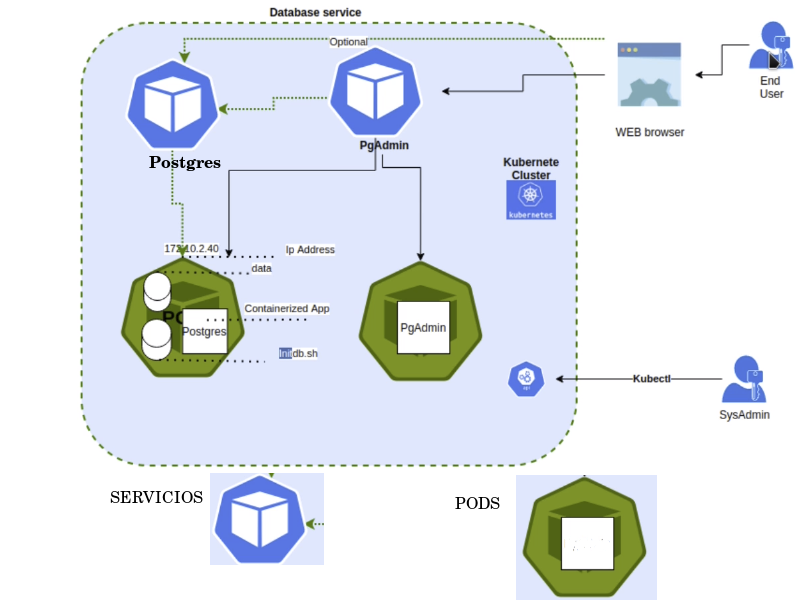

# SECCIÓN DE PRACTICAS Y EJERCICIOS


# 7 PRACTICA Cluester y Pods

Servicio en cluster de kubernetes que tiene una BD (postgresql) y un administrador web. El usuario final puede cnectarse al motor de la BD con otro cliente. Se va a definir un *deployment* para la creación de los Pods de Postgres y PgAdmin.


## Arquitectura

Cluester conformado por dos pods, cada uno para la BD y otro para la aplicación. Se montará un servicio de acceso remoto o local para la administración de los pods.

1. Pod Postgres
    - Imagen de postgres
    - Volumen para almacenar datos
    - Segundo volumen para ejecutar scripts
2. Pod PgAdmin
    - Aplicación web




## Creación ficheros de configuración

### Archivos

1. Crear *secret-dev.yaml* para el pod de Postgres
    - para guardar de manera segura contraseñas e información que debe ser cifrada
    - dev es para indicar que es desarrollo
    - agregar datos de la bd cifradas con base64:
        - DB: postgres -> cG9zdGdyZXM=
        - U: postgres -> cG9zdGdyZXM=
        - P: qwerty -> cXdlcnR5
2. Crear *secret-pgadmin.yaml* para el pod de PgAdmin
    - para guardar de manera segura contraseñas e información que debe ser cifrada
    - pgadmin es para indicar que es para el pod de pgadmin
    - agregar datos para pgamin cifradas con base64:
        - PGADMIN_DEFAULT_EMAIL: admin@admin.com -> YWRtaW5AYWRtaW4uY29t
        - PGADMIN_DEFAULT_PASSWORD: qwerty -> cXdlcnR5
        - PGADMIN_PORT: 80 -> ODA=
3. Crear *persistence-volume.yaml* para el almacenamiento persistente
    - para definir las propiedades del amlmacenamiento que en este caso es persistente
4. Crear *persistence-volume-claim.yaml* para definir como son las peticiones que debe hacer una aplicación para usar el almacenamiento
    - agregar en *data* todos los permisos, tambien agregar permisos del schema por probeblmas anteriores dados en las aplicaicones con Docker

    ```bash
    #!/bin/bash
      set -e
      psql -v ON_ERROR_STOP=1 --username "$POSTGRES_USER" --dbname "$POSTGRES_DB" <<-EOSQL
      CREATE USER billingapp WITH PASSWORD 'qwerty';
      CREATE DATABASE billingapp_db;
      GRANT ALL PRIVILEGES ON DATABASE billingapp_db TO billingapp;
      GRANT ALL ON SCHEMA public TO billingapp;
    EOSQL
    ```

5. Se crea *deployment-postgres.yaml* para construir los dos pods mediante un *deployment*
   - archivo de tipo *Deployment*
   - Imagen: *containers* especifica la imagen que se usara, en este caso se va a descargar - postgres:latest
   - Para la creación e inicializacion de la BD y configuración del motor de bd se usan relacionan las configuraciones contenidas en:
   - Lee las variables cifradas secret definidas en *data* que se usaran como credenciales *secret-dev.yaml*
   - Usa la configuracion para el motor db definida en *spec* *persistence-volume-claim.yaml*
   - Usa el scrip de inicializacion deinido en *spec* dentro de *configmap-postgres-initdb.yaml*
6. Se crea *deployment-pgadmin.yaml* para construir los dos pods mediante un *deployment*
   - archivo de tipo *Deployment*
   - Imagen: *containers* especifica la imagen que se usara, en este caso se va a descargar - dpage/pgadmin4  


***

# REFERENCIAS

- [configMap](https://kubernetes.io/docs/concepts/configuration/configmap/)
- [PersistentVolumeClaims](https://kubernetes.io/docs/concepts/storage/persistent-volumes/#persistentvolumeclaims)
- [Volumes](https://kubernetes.io/docs/concepts/storage/volumes/)