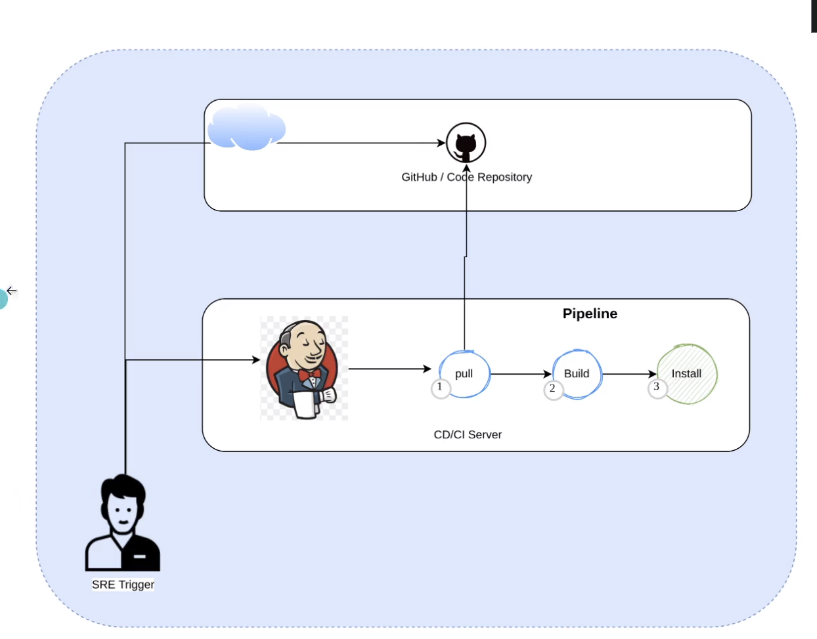

# SECCIÓN DE PRACTICAS Y EJERCICIOS

# 12 PRACTICA Pipeline sencillo Jenkins (Freestyle Project)

Es Jenkins se va a definir un pipeline conactado a un repositorio de guthub, hace pull del repositorio, luego lo compila y lo instala dentro de un servidor CI/CD.

Los desarrolladores envian cambios al repositorio github y es disparado cuando se detecta un pull request.

- El pipeline tiene 3 tareas sencillas y manualmente vamos a hacer de trigger.
- La aplicación Billing es un microservicio en Java
- Debe estar running Jenkins: 'http://localhost:8080/login?from=%2F'
- Projecto Jenkins de tipo Freestyle Project
- Se debe tener un token de acceso para usar en las credenciales de git en jenkins

## 1 Repositorio Github

[pipeline-1-github](https://github.com/Repositorios-de-Estudio/devops-pipeline-1)

## 2 Configuración en Jenkins

1. Create a job
   1. Dar nombre: devops_test1
2. Condigo fuente
   1. git
   2. url: 'https://github.com/Repositorios-de-Estudio/devops-pipeline-1.git'
   3. credenciales: usar personal token
   4. branches: main
3. entorno
   1. build steps
      1. maven de nivel superior
      2. goles: clean install

# PROBLEMAS

## Error

***

# REFERENCIAS
