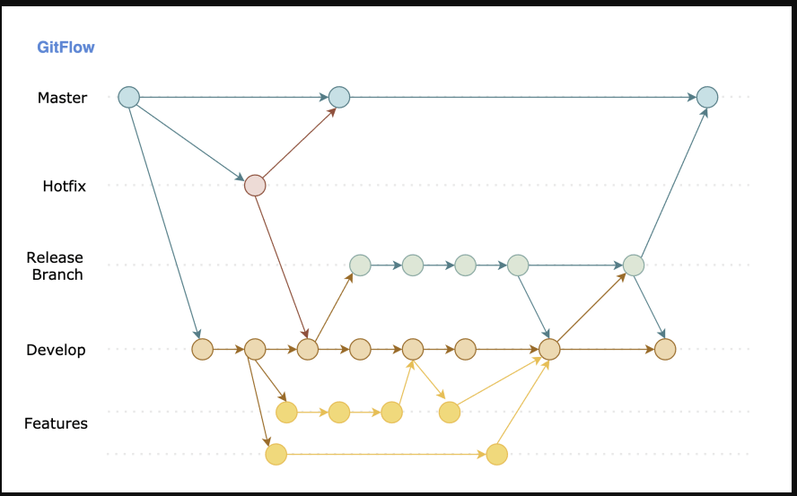
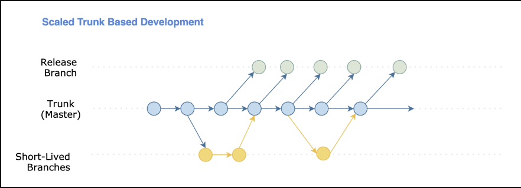
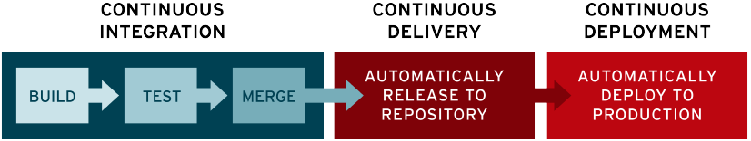
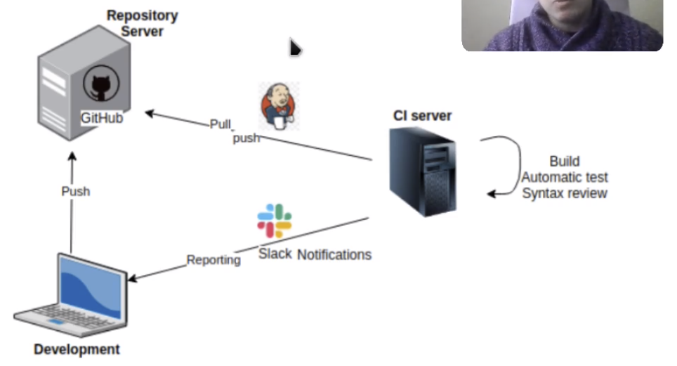
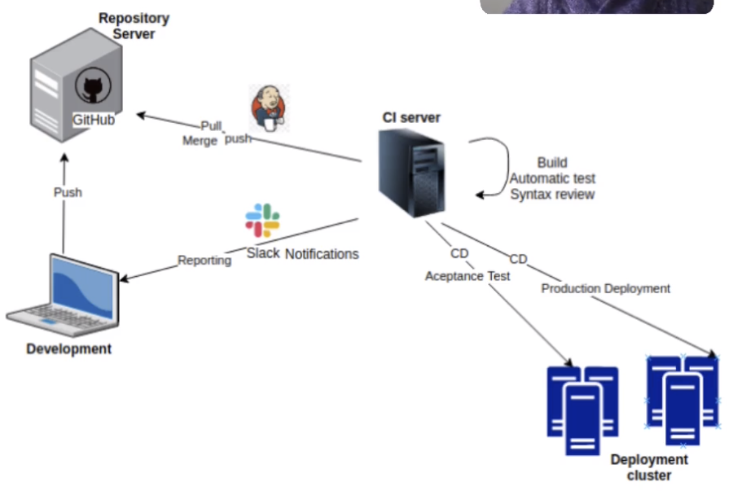
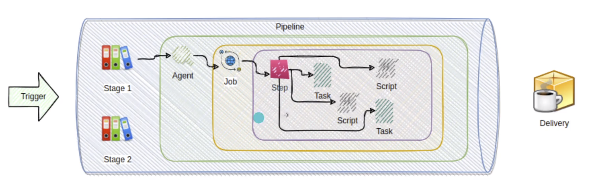

# Curso_DevOpsKubernetes CI / CD

## Curso DevOps con Docker, Jenkins, Kubernetes, git, GitFlow CI y CD

### Tabla de Contenido

1. Introducción DevOps
2. Definiciones basica de DevOps
3. Docker
   1. DockerHub
   2. Docker Swarm
   3. Docker Network
4. Kubernetes
   1. Objetos de Kubernetes
   2. Escalabilidad
   3. Git Flow
   4. Git Trunk Base
5. FLujos de Trabajado basado en git
6. CI/CD (Integración Continua y Entrega Continua)
   1. Webhooks
   2. Jenkins
   3. ngrok
   4. Slack
   5. SonarQube
7. Referencias

### Estructura del Repositorio

1. Proceso Instalación y configuración de Docker en Linux -> **A1-fedora-docker-instalacion.md**
2. Comandos basicos de Docker + ejemplo -> **A2-Comandos-Docker.md**
3. Practicas, ejercicios y ejemplos con Docker -> **Z-1-Practicas-Docker.md**
4. Proceso Instalación y configuración de Kubernetes en Linux -> **A1-fedora-kubernetes-instalacion.md**
5. Comandos basicos de Kubernetes + ejemplo -> **A2-Comandos-Kubernetes.md**
6. Practicas, ejercicios y ejemplos con Kubernetes -> **Z-2-Practicas-Kubernetes.md**
7. Uso de Jenkins y Maven en una imagen Docker -> **A1-Jenkins-instalacion.md**
8. Practicas, ejercicios y ejemplos con Jenkins -> **Z-3-Practicas-Jenkins.md**
9. Comandos basicos de Jenkins + ejemplo -> **A2-Comandos-Jenkins.md**
10. Uso de SonarQube en una imagen Docker -> **A1-Jenkins-instalacion.md**
11. Practicas, ejercicios y ejemplos con SonarQube -> **Z-3-Practicas-SonarQube.md**

***

### Curso de

[Udemy - DevOps con Docker, Jenkins, Kubernetes, git, GitFlow CI y CD](https://www.udemy.com/course/devops-con-dockers-kubernetes-jenkins-y-gitflow-cicd/)

[Youtube - Digitalthinking with sotobotero](https://www.youtube.com/channel/UCzX4ldiZpIwjqMJ9UMY2fMg)

# SECCIÓN DE INTRODUCCIÓN Y DEFINICIONES

# Introduccion

## Funcionalidad Tradicional

### Equipo de Desarrollo

- Creacion de un producto
- Aislamiento de equipos
- Friccion entre los equipos
- Uso de correo (no comunicacion agil)
- Baja automatizacion

### Equipo de Infraestructura (operaciones)

- Velar por el funcionamiento 7/24
- Script rudimentarios
- Calendarios de releases fijos
- Puesta en produccion lenta

## ¿Que es DevOPS?

- Es la union de personas, procesos y tecnologia, con el fin de proporcionar valor continuamente a los clientes.
- DevOps: Development + Operation
- Rol de un integrante de un equipo Devops: Site Reliability Engieneer (SRE)

### Ciclo de vida DevOps - (es un ciclo continuo entre Dev y Ops)

1. (Dev) Plan de proyecto
2. (Dev) Codificacion
3. (Dev) Construccion del entregable
4. (Dev) Pruebas
5. (Ops) Creacion de Release
6. (Ops) Despliegue
7. (Ops) Probando/ejecucanto
8. (Ops) Monitorizacion

### Caracterisiticas

- Equilibrio entre Mayor calidad, Menor tiempo y Menor costo
- Mejores objetivos comerciales
- Mayor satiscaccion del cliente
- Agilidad en las entregas y alto rendimiento
- Mejores productos
- Armonioa entre los equipos
- Menos promblemas en produccion
- Facilidad en el diagnostico y solucion de incidentes
- Evolución:
  1. Servidor fisico
  2. Maquinas Virtuales sobre una Maquina fisica
  3. Virtualizacion de funciones / Contenedores

## Aspectos fundamentales de DevOps

- Control de versiones: git, svn
- CI Integracion continua: Automatizacion de compilaciones y pruebas tras commit >> Pipelines Jenkins
- CD Entrega continua: Suministro de software rapido y confiable en cualquier momento
- Infraestrutura como codigo: Infraestrutura en forma de codigo >> Terraform
  - Se utiliza con el objetivo de establecer y aprovisionar una infraestructura completa, haciendo uso de un lenguaje declarativo sencillo de aprender, que permite almacenar una configuración de la infraestructura en formato de codigo
- Supervision y Registro: Monitorizacion, recopilacion de metricas y vinculacion de datos de performance >> Prometheus, Granafa
- Aprendizaje validado: Analisis de datos para mejorar los procesos en cada ciclo

# Definiciones basicas

- Cluster: Agrupación de un conjunto de hosts de Docker gestionados centraliazadamente, donde hay un host maestro (nodo maestro o **manager**) y otros esclavos (nodos esclavos o **worker**)
- Servicio: (service en Docker) designa una estructura abstracta con la que se pueden definir aquellas tareas que deben ejecutarse en el clúster. Cada servicio está formado por un conjunto de tareas individuales que se procesan en contenedores independientes en uno de los nodos del clúster.  - Cuando se crea un servicio, el usuario determina la imagen de contenedor en la que se basa y los comandos que se ejecutan en el contenedor, operándose sobre la base de la imagen.
- Contenedor: Unidad de software que empaqueta el codigo y todas las dependencias de una aplicacion
  - Dockerfile: Archivo de configuración donde se define la imagen, sus componentes y que se debe ejecutar para funcionar
- Imagen: Paquete ligero y ejecutable de software con todo lo necesario para la aplicacion
  - La Imagen una ves desplegados pasarian a ser Contenedores
- Docker Engine: (o solo Docker) Motor de ejecucion de contenedores
- Docker Hub: Repositorio por defecto para las imaganes de docker
- Podman: Alternativa Opensource a Docker
- Docker Compose: Sistema que permite orquestar/gestionar ligero de contenedores
  - Yamel file: Archivo de configuración  donde se define la version de Docker Engine con la que es compatible (ver matriz de compatibilidad)
- Docker Desktop: Aplicacion de escritorio que integra Docker Engine y Docker Compose
- Docker Swarm: Orquestador de contenedores que permite manejar un cluster
- Orquestacion: Mediante un archivo yml se automatiza de la mayoría de las operaciones necesarias para ejecutar un conjunto de contenedores que trabajan en conjunto. Esto reduce la complejidad en sistemas de gran escala
- Kubernetes: Sistema para la administracion de clusters y Orquestador Empresarial de contenedores
- Volumenes: Son el almacenamiento externo a los contenedores
  - compuesto por la ruta local : el punto de montaje dentro del contenedor: `/var/lib/postgres_data:/var/lib/postgresql/data`
  - Cuando ya existe el archivo en el host del volumen, este no se vuelve a crear y puede generar errorres en los contenedores por lo que es mejor borrarlos antes
- Mapeo de Puertos:
  - Los contenedores esta compuestos por sockets, la cual recibe la peticion desde internet
    - La peticion rl host la recibe mediante un puerto el cual redirige la peticion el servicio que debe atender
    - Si el puerto corresponde a un contenedor, el host mapea el puerto al puerto del contener (que conoce el docker engine) y redirige la peticion al servicio del contenedor
  - Socket del host: socket = IP+Port
  - Se recibe una peticion por el puerto 8082, el host mapea al puerto 8080 del contendor: https://minute.com:8082 -> contenedor:8080
- DockerHub: Es un repositorio de imagenes de acceso publico: https://hub.docker.com/
- Adminer (anteriormente phpMinAdmin) Administrador grafico de bases de datos: MySQL, SQLite, Oracle, PostgreSQL de manera efectiva.
- Pipelines: Grupo lógico de actividades que trabajan de manera conjunta para realizar una tarea

## Docker

Tecnologia que permite empaquetar aplicaciones con todas sus dependencias para hacerlas postables y conseguir ejecución independiente del SO.

Alternativas

  1. Podman
  2. OpenVZ
  3. VirtualBox
  4. Kubernetes (K8)
  5. LXC (Linux Containers)
  6. Microsoft Azure Container Registry
  7. Containerd
  8. Rancher
  9. Vagrant
  10. ZeroVM

### Sobre los archivos DockerFile

**FROM**: Indica la imagen base la cual será la base para crear una nueva imagen. ej: imagen base y variante

**RUN**: Se usa para ejecutar instrucciones propias del SO del contenedor cuando se esta contruyendo la imagen. ej: Instalación de cosas en el SO

**CMD**: Sirve para especificar el comando por defecto que se ejecuta al iniciar el contenedor si no se especifica ningun servicio como argumento.

**ENTRYPOINT**: Sirve para especificar el comando por defecto que se ejecuta al iniciar el contenedor, si no se especifica ningun servicio como argumento, la diferencia con CMD radica en la manera como de como trata los argumentos docker. (Indica en que orden se ejecuta el codigo)

## Docker Hub

1. Buscar imagen
2. En description la información de version de las imaganes
3. Bajar imagen:
  - Metodo 1: Con el comando: `docker pull postgres`
  - Metodo 2: Con el archivo yml: 
    - Uso por via psql stack.yml para ejecutar con docker-compose
    - Copiar contenido stack.yml
    - ver ".../2-practica1-postgres/docker-compose.yml" // se renombr el archivo a docker-compose.yml
    - ejecutar:
      - Metodo 1: `docker-compose pull` //cuando el archivo se llama docker-compose.yml
      - Metodo 2: `docker-compose -f stackdb.yml pull` // archivo con nombre acualquiera.yml
4. Listar imaganes y verificar que esten: postgres y adminer `docker image ls`
5. Crear contenedores simultaneamente (ejecutar):
    - ejecutar: Como uno depende de otro, el otro se levanta cuando el primero inicia
      - Metodo 1: `docker-compose up -d` // para archivo docker-compose.yml, -d: backgroud
      - Metodo 2: `docker-compose -f stackdb.yml up -d` // para otro nombre acualquiera.yml
6. Listar contenedores y verificar: `docker ps -a`
7. Comprobar: `http://localhost:9090/`
  - Ingresar con credenciales al adminer:
    - Motor: Postgres, servidor: db, u: postgres, p: example, base de datos: postgres
8. Detener contenedores: `docker stop adminer` y `docker stop postgres`

## Docker Swarm

Similar y reemplaza a Docker Compose, se basa en una arquitectura maestro-esclavo. Cada clúster de Docker está formado un manager y tantos workers como sea necesario. Mientras que el nodo maestro es responsable de la gestión del clúster y la delegación de tareas, el esclavo se encarga de ejecutar las unidades de trabajo (tasks).

**Se usa un cluster cuando con varias maquinas (cluster) se quiere tener toleracia a fallos y alta disponibilidad.**

Docker Swarm soporta dos modos de definir servicios swarm: servicios globales o replicado:

1- Servicios replicados: Desde un nodo master se crear n replicas (nodos workers) que permite que en caso de que algun nodo no este disponible otro nodo responda. 
2- Servicios globales: si un servicio se ejecuta en modo global, cada nodo disponible en el clúster inicia una tarea para el servicio correspondiente. Si al clúster se le añade un nodo nuevo, el nodo maestro le atribuye una tarea para el servicio global de forma inmediata. Este tipo de servicios se recomiendan para las aplicaciones de monitoreo o los programas antivirus.

## Docker Network - virtual environments

Cuando se requiere tener varios entornos (ej: pruebas, producción) fisicamente en una misma maquina pero funcionando aislados uno de otro, se puede optar por tenerlos en segmentos de red diferentes. De esta manera estaran en redes separadas ási cada contenedor tendrá una IP diferente a las que se puede acceder independiente.

La solución no optima sería tener dos maquinas fisicas donde cada contenedor se ejecute de manera indpendiente, teniendo así una maquina para pruebas y otra para produccion.

Ej campo de aplicació de Docker Swarm: Reparto de cargas, pues con el modo enjambre Docker dispone de funciones integradas de balanceo de carga. Si se ejecuta, por ejemplo, un servidor web NGINX con cuatro instancias, Docker distribuye las consultas entrantes de forma inteligente entre las instancias del servidor web disponibles.

# Kubernetes

Plataforma de orquestacion de contenedores de codigo abierto creado por Google para facilitar la administración de los contenedores. Su función principal permite administradar las cargas de trabajos de manera eficiente y crear automatizaciones para aumentar la productividad a la vez que se reducen costos. 

* Caracterisiticas principales
  - Facilidad a exponer servicios
  - Escalado horizontalmente
  - Equilibrio de carga
  - Orquestación de almacenamiento
  - Despliegues y reversiones automatizadas
  - Autoreinicio
  - Opensource
  - Inspirado en Borg de Google
  - Licencia Apache V2
  - Escrito en GO
  - Mantinido por Cloud Native Computing Foundation (Linux Foundation)

* Tipos de instalación
  1. On-premise
    - Toda la infraestructura es dada por la propia empresa
    - Tipos de On-premise
      - All in one: Se instala todo en un unico nodo usando *mini kube* para educación o pruebas
      - Single master and multiworker
      - Single master, single etcd and multiworker
      - Multi master, and multiworker
      - Multi master, multi etcd and multiworker

  2. Gestionado
  - Se hace uso de un servicio como AKS (Azure), EKS (Amazon Elastic), GKE (Google), IBM Clod

## Objetos de Kubernetes

En Kubernetes todos se trata como objetos y estos se definen en archivos yamel (.yml). \

Las definiciones se guardan y ejecutan el cluster mediante el API Server. \
Las definiciones de objetos se conocen tambien como infraestrutura como codigo.

* Tipos de Objeto
  - PODs: Unida mas pequeña que se puede desplegar y gestionar en Kubernetes. Es un prupo de uno o mas contenedores que comparten almacenamiento y red y especificaciones de como ejecutarse. Estos son efimeros
    - efimero: que el cluster pueda eliminar y volver a crear un contenedor cuando sea necesario
  - Deployments: Describe el estado deseado de una implementación, ejecuta multiples replicas de la aplicacion, reemplaza las que estan defectuosas o las que no responden
  - Services: Definición de como exponer una aplicación que se ejecuta en un conjunto de pods como un servicio de red (por defecto se usa roud-robin para balanceo de carga)
  - Condig Map: Permite desacoplar la configuración para hacer las imagenes mas portables, almacenan variables de entorno, argumentos para linea de comandos, o configuracion de volumenes que pueden consumir los pods (encripación o no)
  - Labels: Pares de clave valor ("environment";"qa") para organizar, seleccionar, consultar y monitorear objetos de forma mas eficiente, ideales para UI y CLIs.
  - Selectores: Mecanismo para hacer consultas a los Labels. kubctl get pods -l 'environment in (production), tier in (fronted)'

## Administracion

Clientde de Kubernetes, la cual es una herramienta de línea de comandos para interactuar con la API de Kubernetes, utilizada para gestionar la mayor parte de objetos de Kubernetes, tales como los pods, servicios, namespaces, etc. Además permite conocer el estado general del clúster.

La administración con *kubctl*, se hace por medio de su interfaz como WEB API o por medio de consola. El rol de SysAdmin es quien administra y usa *kubctl*.

## Nodos / Tipos de nodos

Como minimo se tiene un nodo Master y un nodo Worker.

* Alternativas (mas pontente al menos potente)
  - OpenShift (es una capa de kubernetes)
  - Docker Swarm (ambientes empresariales pequeños/clusters)
  - Docker Compose (ambientes pequeños)

### Nodos Master

Nodos que realizan la propia gestion de la insfraestructura.

* Componentes
  - etcd/: lugar donde se almacena la data 
  - Scheduler: esta a tento a nuevos alos nuevos depliegues y lo aisgna al nodo que mejor se ajuste
  - Control Manager: se encarga de monitorizar y genera alertas o reliza las tareas automaticas
  - API server: sirve de comunicador entre nosotros y los componentes del cluster (interfaz kubectl) y entre los nodos workers con los nodos master

### Nodos Worked

Nodos que se encargan de ejecutar todas las tareas propias de la aplicación.

* Componentes
  - Networking (red): Donde se configura si esta expuesto o no, configuracion de red interna y restricciones de red
  - Kubelet (monitor): Agente monitoriza el funcionamiento de cada nodo
  - Container Runtime (docker u otro): Es el propio contenedor
  - Operator System (SO): EL sistema operativo donde se ejecuta el nodo
  - Hardware: Hardware que soporte el nodo

## Escalabilidad

Capacidad de un sistema para adaptarse al crecimiento por demanda y complejidad. 

## Escalabilidad Vertical
Aumentar la potencia de un mismo nodo agregando mayor potencia de commputo: RAM, almacenamiento, GPU, CPU,... etc

### Carateristicas

  1. Unico nodo
  2. Aumento de potencia de computo
  3. Esta limitado por las prestaciones maximas del hardware
    - maximo numero de cpus o numero de nucleos
    - maximo numero de discos
    - maximo numero de modulos de ram o num de nucleos
    - maximo consumo energetico
    - otras limitaciones de hardware
    - limitaciones del SO

## Escalabilidad Horizontal

Agregar mas nodos para que se adapten a la carga de trabajo.

Carateristicas

  1. ofrece mayor eficiencia en costo
  2. varios nodos (cluster)
  3. aumento de nodos con las mismas caracteristicas
  4. se agrega un nodo para balancear la carga

***

# FLujos de Trabajado basado en git

## Git Flow y Git trunk-base

Ver en [Curso: GIT+GitHub: Todo un sistema de control de versiones de cero](https://github.com/Repositorios-de-Estudio/Git-GitHub)

## Git Flow

Flujo de trabajo que permite estructurar de forma eficiente las ramas del repositorio de git. Esta es una metodologia muy fuertemente escructurada

[Fuente](https://dev.to/marianocodes/por-que-trunk-based-development-i5n)

## Trunk Base

Flujo de trabajo que permite realizar pequeños cambios a la rama principal de manera frecuente. El estilo de trabajo es basado en la rama principal o tronco. Esta es una metodologia flexible y la compañia decide que principios seguir.

[Fuente](https://dev.to/marianocodes/por-que-trunk-based-development-i5n)

***

# CI/CD (Integración Continua y Distribución Continua)

La CI/CD es un método para distribuir las aplicaciones a los clientes con frecuencia mediante el uso de la automatización en las etapas del desarrollo de las aplicaciones.

Esto incorpora la automatización y la supervisión permanentes en todo el ciclo de vida de las aplicaciones, desde las etapas de integración y prueba hasta las de distribución e implementación. Estas prácticas vinculadas se conocen como **canales de CI/CD** o **Pipelines**.

Los desarrolladores envian cambios al repositorio central (GitHub), luego el sevidor CI detecta cambios (hace pull de github) y ejecuta tareas (build, test,review) de automatización con una herramienta (Jenkins), si la validación es exitosa (pruebas) se hace un merge de los cambios a la rama principal (en github); del merge y de los resultados de la herramienta CI se crean reportes (Slack notifications) los cuañes se notifican. \

En este proyecto, el **Servidor de Integración Continua** (Server CI/CD) es donde esta instalado Jenkins.

## Herramientas comunes de CI/CD

1. Jenkins
2. Tekton Pipelines
3. Travis-CI
4. CircleCI
5. GitHub
6. GitLab
7. Azure DevOps Server

## Herramientas para la gestion CI/CD

1. Pipeline: Grupo lógico de actividades que trabajan de manera conjunta para realizar una tarea
   1. Ej: Se crea un pipleine que: contruya el codigo con cambios, ejecute pruebas y haga el merge
2. Jenkins: ervidor de automatización OpenSource
3. Slack: Plataforma propietaria empresarial de comunicación de equipos
   1. Su caracteristca de Channel permite recibir las notificaciones de de los resultados de pruebas y despliegue
4. SonarQube: Plataforma OpenSource que inspecciona el codigo asegurando la calidad del codigo
   1. recomienda mejoras de codigo, optimizaciones
   2. soporta  varios lenguajes
   3. ofrece graficos, metricas e informes
5. Selenium: Framework para prueba de aplicaciones web para hacer test funcionale

## Herramientas adicionales

1. Uso de WebHook para eventos y enviar notificaciones a Jenkins.
2. Uso de ngrok, es un proxy inverso para exponer el puerto a internet el Servidor CI/CD local para poder enviar las notificaciones a Jenkins

La instalación y uso de ngrok esta en: *A1-fedora-Jenkins-instalacion.md*

## CI - Continuos Integration

Se refiere a la integración continua, que es un proceso de automatización para los desarrolladores donde implica que se diseñen, prueben y combinen los cambios nuevos en el código de una aplicación con regularidad en un repositorio compartido.

1. Integración de código de manera automatizada de varios desarrolladores.
2. Permite a los desarrolladores realizar merge frecuentemente en un repositorio central.La compilación y pruebas automaticas sean ejecutadas.
3. El sistema de control de versiones es el core de todo el proceso de integración y se puede complementar con pruebas de codigo automatico, revision de sistanxis, etc.

## CD - Continuous Delivery y Continuous Deployment

Se refiere a la (1) distribución y/o la (2) implementación continuas, y se trata de conceptos relacionados, ambos se refieren a la automatización de las etapas posteriores del proceso CI.

### Continuos Delivery

El propósito de la distribución continua es garantizar que la implementación del código nuevo se lleve a cabo con el mínimo esfuerzo. Se refiere a que los cambios que implementados someten a pruebas automáticas de errores y se cargan al repositorio, para luego ser implemntado por el equipo de operaciones en un entorno de producción. 

Esto solución el problema de la poca supervisión y comunicación entre los equipos comerciales y de desarrollo.

1. Continua luego de CI, luego de su validación y pruebas con los cambios ya agregados
2. Se despliega y construye automaticamente la aplicación con los cambios, generalmente a los entornos de pruebas o tambien a producción

### Continuous Deployment

Se refiere al lanzamiento automático de los cambios que implementa el desarrollador desde el repositorio hasta producción. Con este tipo de implementación, se aprovechan los beneficios de la distribución continua y se automatiza la siguiente etapa del proceso.

Esto soluciona el problema de la sobrecarga a los equipos de operaciones con procesos manuales que retrasan la distribución de las aplicaciones.

1. Cuando la aplicaición pasa las etapdas anteriores se hace release en producción.

***

# Pipelines en Jenkins

Grupo lógico de actividades que trabajan de manera conjunta para realizar una tarea. Los pipelines son independientes del SO, son una herramienta para automatizar tareas en administración y desarrollo. Se recomienda realizar un diagrama para ser lo mas eficientes posible. \

Las tareas (tasks) se agrupan en pasos (Steps), los pasos son agrupados en (Jobs) el Job es ejecutado por un Agent (Jenkins hace de agente), todo esto se organiza dentro de un Stage, pueden haber varios Stages para varios propositos, ej: calidad, producción, compilación. La agrupación de los Stages hacen una Pipeline. \

Los eventos dentro de la Pipeline se disparan con un evento Trigger. \

## Practicas

Ubicación archivos: *Practicas-Jenkins.md*, *12-pipelines-jenkis*  y *13-pipeline-webhook-ngrok*
Guia de Comandos: *A2-Comandos-Jenkins.md*\
Repositorio: 'https://github.com/Repositorios-de-Estudio/devops-pipeline-1' y 'https://github.com/Repositorios-de-Estudio/pipeline-java-angular'

# SonarQube

Plataforma opensource para la inspección continua de la calidad de codigo, a travez de analisis estatico de codigo fuente, proporciona metricas sobre para ayudar a mejorar la calidad de codigo. Principalmente es una herramienta usada para testing y la auditoria de codigo.

Caracterisiticas

- Opensource
- Se puede instalar localmente o como servidor
- Se pueden ampliar las capacidades mendiante plugins
- caracteristicas internars
  - Soporta administración de usuarios, grupos, permisos y roles
  - funciona por medio de proyectos
    - creados de manera manual
    - creados automaticamente como se hace con Jenkins
- Soporte multitud de lenguajes
- testing y auditoria de codigo
- metricas sobre el codigo
  - complejidad de codigo
  - codigo duplicado
  - errores potenciales
  - mantenibilidad
  - calidad
  - tamaño
  - pruebas
- Evaluación de codigo por
  - Bugs: problemas menores de codigo
  - vulnerabilidades y Hostpost: Sobre vulnerabiliades en seguridad
  - code smells: aspectos a mejorar sobre el codigo
  - duplicaciones: lineas de codigo duplicadas
- (Rules) El analisis se hace en funciones de reglas
  - creadas para cada lenguaje
  - reglas predefinidas
  - crear reglas personalizadas (requiere integrarlos en un quality profile)
- (Quality profiles) se aplican reglas en el anilisis segun el lenguaje
  - Conjunto se reglas que se aplican en el analisis (usar esto cuando se crea una regla)
- (quality gates) puerta de calidad
  - Umbral de metricas para determinar la calidad
- En (issues) todos los issues de todos los proyectos, pemite filtrar y ver mas detalles y recoemndaciones segun la evaluación de codigo

Ventajas

1. detecta y notifica problemas
2. ayuda a reducir complejidad, capacidad de mantenimiento -> aumentar su vida util
3. eficiencia -> reduce duplicidad del codigo
4. calidad alta del codigo -> informa sobre calidad y violacion de estandares
5. es facilmente escalable
6. ideal para gestion continua

Ubicación archivos: *Z-4-Practicas-SonarQube.md* y *A1-SonarQube-instalacion.md*  
Guia de Comandos: Se puede encontrar sobre su uso en la instalación
Repositorio: Basado en el ejercicio 15

***

# Referencias

1. Lectura recomendada clase 3 [Tutorial de DevOps: introducción](https://azure.microsoft.com/es-es/solutions/devops/tutorial/)
2. Lectura recomendada clase 14 [volumes y mapeo de puertos en docker](https://www.youtube.com/watch?v=GwnDA-oXShI&ab_channel=Digitalthinkingwithsotobotero)
3. [Documentación Docker](https://docs.docker.com/engine/)
4. DockerHub [Repositorio de imaganes](https://hub.docker.com/)
5. [Matriz de compatibilidad](https://docs.docker.com/compose/compose-file/compose-versioning/#versioning)
6. [DockerFile reference](https://docs.docker.com/engine/reference/builder/)
7. [Docker swarm oficial](https://docs.docker.com/engine/swarm/)
8. [Docker swarm explicacion](https://www.icm.es/2020/10/24/docker-swarm/)
9. [CI/CD por RedHat](https://www.redhat.com/es/topics/devops/what-is-ci-cd#:~:text=La%20CI%2FCD%20es%20un,distribuci%C3%B3n%20y%20la%20implementaci%C3%B3n%20continuas.)
