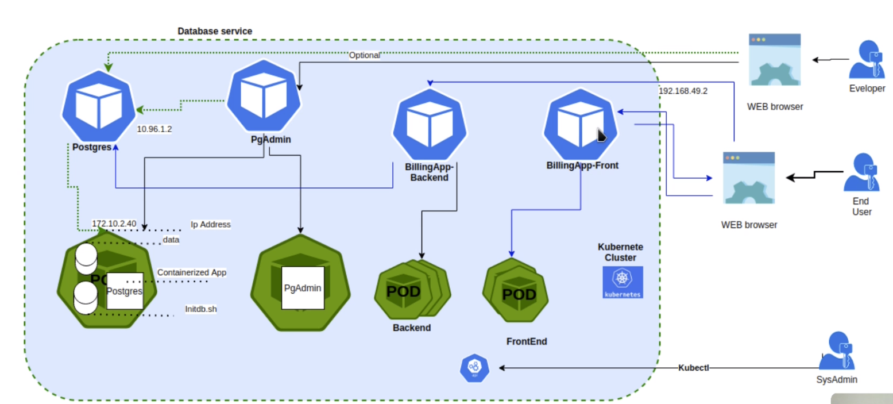

# SECCIÓN DE PRACTICAS Y EJERCICIOS Kubernetes

# Creacion de POD: Prueba con imagen billingapp

1. Tener imagen dockerisada: <https://hub.docker.com/r/sotobotero/udemy-devops/tags>
2. Recomiendan tener solo el docker de minikube `docker ps -a`
3. crear pod: `kubectl run nombre_cualquiera -- image=url-imagen --port=puerto1 puerto2`
    - puerto1 = puerto expuesto a internet (externo)
    - puerto2 = puerto expuesto dentro del Pod
    - `kubectl run kbillingapp --image=sotobotero/udemy-devops:0.0.1 --port=80 80`
4. Salida de la consola: *pod/kbillingapp created*
5. Comprobar pod:
    - por dashboard: Pods : kbillingapp
    - por kubectl: `kubectl get pods`
        - detalles: `kubectl describe pod kbillingapp`
6. Exponer servicio
    - kbillingapp: Es el nombre del pod
    - Tipo: Applicación de tipo Load Balancer
    - Port: Puerto expuesto a internet (exte no será el puerto por donde se accede)
    - Target-port: Puerto del cluster
    - Exponer con: `kubectl expose pod kbillingapp --type=LoadBalancer --port=8080 --target-port=80`
    - Salida de la consola: *service/kbillingapp exposed*
    - Comprobar: `kubectl get services` \\ Debe estar kbillingapp
7. Ver servicio: `kubectl describe service kbillingapp`
    - Ahora se tiene un pod llamado *kbillingapp* y un servicio llamado *kbillingapp*
    - En dashboard de minikube tambien se ve el servicio
8. Acceder a la aplicación: `minikube service --url kbillingapp`
    - resultado: <http://192.168.49.2:30777>
9. Ver logs:
    - Desde dashboard de minikube: *Pods > nombre-del-pod >> Logs*
    - Desde Terminal: `kubectl logs kbillingapp`

# 7 PRACTICA Cluster Kubernetes con pods

Servicio en cluster de kubernetes que tiene una BD (postgresql) y como aplicación un administrador de BD web. El usuario final puede conectarse al motor de la BD con otro cliente. Se va a definir un *deployment* para la creación de los Pods de Postgres y PgAdmin.

Para el acceso desde internet se usaran dos servicios: PgAdmin y Posgres los cuales son accesibles desde el WEB Browser.

## Arquitectura

Cluester conformado por dos pods, cada uno para la BD y otro para la aplicación. Se montará un servicio de acceso remoto o local para la administración de los pods.

1. Servicio Posgre: Servicio para administra la BD
2. Servicio PgAdmin: Servicio web que permite administrar la BD
3. Pod Postgres
    - Imagen de postgres
    - Volumen para almacenar datos
    - Segundo volumen para ejecutar scripts
4. Pod PgAdmin
    - Aplicación web


## Creación ficheros de configuración

### Archivos

1. Crear *secret-dev.yaml* para el pod de Postgres
    - para guardar de manera segura contraseñas e información que debe ser cifrada
    - dev es para indicar que es desarrollo
    - agregar datos de la bd cifradas con base64:
        - DB: postgres -> cG9zdGdyZXM=
        - U: postgres -> cG9zdGdyZXM=
        - P: qwerty -> cXdlcnR5
2. Crear *secret-pgadmin.yaml* para el pod de PgAdmin
    - para guardar de manera segura contraseñas e información que debe ser cifrada
    - pgadmin es para indicar que es para el pod de pgadmin
    - agregar datos para pgamin cifradas con base64:
        - PGADMIN_DEFAULT_EMAIL: admin@admin.com -> YWRtaW5AYWRtaW4uY29t
        - PGADMIN_DEFAULT_PASSWORD: qwerty -> cXdlcnR5
        - PGADMIN_PORT: 80 -> ODA=
3. Crear *persistence-volume.yaml* para el almacenamiento persistente
    - para definir las propiedades del amlmacenamiento que en este caso es persistente
    - en *hostPath > path* Se define donde se va a montar la BD persistente dentro del cluster de minikube
4. Crear *persistence-volume-claim.yaml* para definir como son las peticiones que debe hacer una aplicación para usar el almacenamiento
    - agregar en *data* todos los permisos, tambien agregar permisos del schema por probeblmas anteriores dados en las aplicaicones con Docker

    ```bash
    #!/bin/bash
      set -e
      psql -v ON_ERROR_STOP=1 --username "$POSTGRES_USER" --dbname "$POSTGRES_DB" <<-EOSQL
      CREATE USER billingapp WITH PASSWORD 'qwerty';
      CREATE DATABASE billingapp_db;
      GRANT ALL PRIVILEGES ON DATABASE billingapp_db TO billingapp;
      GRANT ALL ON SCHEMA public TO billingapp;
    EOSQL
    ```

5. Se crea *deployment-postgres.yaml* para construir los dos pods mediante un *deployment*
   - archivo de tipo *Deployment*
   - Imagen: *containers* especifica la imagen que se usara, en este caso se va a descargar - postgres:latest
   - Para la creación e inicializacion de la BD y configuración del motor de bd se usan relacionan las configuraciones contenidas en:
   - Información en etiquetas *persistentVolumeClaim* y *configMap*
     - Lee las variables cifradas secret definidas en *data* que se usaran como credenciales *secret-dev.yaml*
     - Usa la configuracion para el motor db definida en *spec* *persistence-volume-claim.yaml*
     - Usa el scrip de inicializacion deinido en *spec* dentro de *configmap-postgres-initdb.yaml*
6. Se crea *deployment-pgadmin.yaml* para construir los dos pods mediante un *deployment*
   - archivo de tipo *Deployment*
   - Imagen: *containers* especifica la imagen que se usara, en este caso se va a descargar - dpage/pgadmin4  
   - Información en etiqueta *envFrom* lee información cifrada de *secret-pgadmin.yaml* en *data* para cargar en *secretRef*
7. Se crea *service-postgres.yaml* para crear el servicio de administración de Posgres
    - archivo de tipo *Service*
    - tipo de servicio *Nodeport* que indica que usa el mismo puerto del nodo, al ser un nodo no tendra problemas
    - Puerto interno definido en *port*
    - Puerto expuesto definido en *nodePort*
8. Se crea *service-pgadmin.yaml* para crear el servicio de administración de la aplicaicon PgAdmin
    - archivo de tipo *Service*
    - tipo de servicio *Nodeport* que indica que usa el mismo puerto del nodo, al ser un nodo no tendra problemas
    - Puerto interno definido en *port*
    - Puerto expuesto definido en *nodePort*
9. Construir y desplegar todo el despleigue, al finalzar cada comenado se pueden ver en el dashboard creados (`minikube dashboard`)
   - Verificar stado de minikube `minikube status` debe estar running
     - secrets:
       - `kubectl apply -f secret-dev.yaml`
       - `kubectl apply -f secret-pgadmin.yaml`
     - configmap:
       - `kubectl apply -f configmap-postgres-initdb.yaml`
     - volumenes:
       - `kubectl apply -f persistence-volume.yaml`
       - `kubectl apply -f persistence-volume-claim.yaml`
     - cración de Pods:
       - `kubectl apply -f deployment-postgres.yaml`
       - `kubectl apply -f deployment-pgadmin.yaml`
   - Verificar: 2 servicios, +2 servicios, 2 deplyoments, 1 replica cada uno:
   - en dashboard
   - en consola: `kubectl get all`
   - **Se puede aplicar todo con:** `kubectl apply -f ./`
10. pruebas de funcionamiento, se ingresa por los dos servicios creados de Posgres y PgAdmin, se accede a la BD mediante el servicio, se puede tambien acceder por el POD
    - Consultar IP del cluster: `minikube ip`  esto retorna ip-cluster = *192.168.49.2*
    - Consultar IP externa: `kubectl get services` ver *PORTS interno:externo* del servicio de pgadmin
    - Entrar al portal de PgAdmin: *retorna ip-cluster:PORTSexterno* ejemplo:<http://192.168.49.2:30200>
      - Credenciales en **secret-pgadmin.yaml*
      - U: admin@admin.com
      - P: qwerty
11. Administrar la BD desde App PgAdmin: La ip es la del *ip-cluster*, el puerto de postgres se saca del servicio de postgres *PORTS externo*, las credenciales de la DB estan en *secret-dev.yaml*
    - En el portal PgAdmin > Add Server:
      - General > Name: {dar un nombre cualquiera} postgresservice
      - Connextion > Host Name: *ip-cluster* (192.168.49.2)
      - Port: *PORTS externo* (30432)
      - database: postgres
      - username: postgres
      - password: qwerty
      - <192.168.49.2:30432>
    - La BD ahora sale Servers > postgresservice:
      - Deben haber dos BD:
        - billingapp_db
        - postgres
    - NOTA: Tambien se puede ingresar a billigapp_bd
12. OPCIONAL Administrar DB mediante su POD postgres: La IP de la BD ya no es la del cluster, ahora se consulta la ip del servicio de postgres con el puerto interno *PORTS interno:externo*, ambas cosas se pueden ver en `kubectl get services`
    - En el portal PgAdmin > Add Server:
      - General > Name: {dar un nombre cualquiera} postgrespod
      - Connextion > Host Name: *ip-servicio-postgres*  (10.97.218.234)
      - Port: *PORTS interno* (5432)
      - database: postgres
      - username: postgres
      - password: qwerty
      - <10.97.218.234:5432>
    - La BD ahora sale Servers > postgresservice:
      - Deben haber dos BD:
        - billingapp_db
        - postgres
    - NOTA: Tambien se puede ingresar a billigapp_bd
13. Eliminar todo
    - Uno por uno:
      - `kubectl delete -f deployment-pgadmin.yaml`
      - `kubectl delete -f deployment-postgres.yaml`
      - `kubectl delete -f persistence-volume-claim.yaml`
      - `kubectl delete -f persistence-volume.yaml`
      - `kubectl delete -f configmap-postgres-initdb.yaml`
      - `kubectl delete -f secret-pgadmin.yaml`
      - `kubectl delete -f secret-dev.yaml`
    - Elimar todo con un solo comando: `kubectl delete -f ./`

# 8 PRACTICA Cluster Kubernetes con pods y alta disponibilidad

Servicio en cluster de kubernetes con alta disponibilidad que tiene (1) una BD (postgresql), (2) con una aplicación de administrador de BD web y una app compuesta por (3) Backend y (4) Frontend.

Para el acceso desde internet se usaran los servicios: PgAdmin y Posgres los cuales son accesibles desde el WEB Browser.

El servicio de postgres tiene ip fija *10.96.1.2* para se pueda acceder a la BD independiente de si cambia la IP del pot de postgres. Como el pod es efimero la IP puede cambiar, así que, se usa el servicio para hacer de intermediario y mantener una IP fija para que pueda ser accedida por la aplicación.

Para el acceso del usuario a la aplicación se usa el servicio Front, luego el front devuelve como se hace la petición al back, el browser la ejecuta y envia directamente la peticion al back. Se espera que la IP del cluster sea *192.168.49.2* para que funcione correctamente la petición al back.

Se necesitan crear las imagenes para el Front y Back para luego poder crear los contenedores.

## Arquitectura

1. Servicio Posgres: Servicio para administra la BD con IP Fija
2. Servicio PgAdmin: Servicio web que permite administrar la BD
3. Servicio Front
4. Servio Back
5. Pod Postgres
    - Con persistencia
    - Imagen de postgres
    - Volumen para almacenar datos
    - Segundo volumen para ejecutar scripts
6. Pod PgAdmin
    - Aplicación web
7. Pod FrontEnd (x2 replicas)
   - Angular
   - Alta disponilidad
8. Pod BackEnd (x3 replicas)
   - Java - SprintBoot
   - Alta disponibilidad



1. Apuntar repositorio docker engine hacia el registro minikube para que minikube use las imagenes locales:
   - comando:

```bash
minikube docker-env
eval $(minikube -p minikube docker-env)
```

2. Agregar permisos adicionales en *db/configmap-postgres-initbd.yaml*

```bash
GRANT ALL ON SCHEMA public TO billingapp;
```

3. Contruir imagenes

```bash
cd billingApp_images_v4/java 
docker build -t billingapp-back:0.0.4 --no-cache --build-arg JAR_FILE=./\*.jar .
cd ../angular 
docker build -t billingapp-front:0.0.4 --no-cache .
```

4. Crear objetos con los deployments

```bash
cd ../../billingApp
kubectl apply -f ./
cd ..
cd db
kubectl apply -f ./
```
5. Probar
   1. Datos
      1. Minikube IP = 192.168.49.2
      2. `kubectl get all | grep -i service`
         1. service/billing-app-back-service - 10.98.227.71 - 7080:30780/TCP
         2. service/billing-app-front-service -  10.110.235.245 - 80:30100/TCP
         3. service/pgadmin-service - 10.101.193.55 - 80:30200/TCP
         4. service/postgres-service - 10.96.1.2 - 5432:30432/TCP
   2. Aplicación
      1. Front: 192.168.49.2:30100
      2. Admin web de la BD PgAdmin: 192.168.49.2:30200
         1. admin@admin - qwerty
         2. servers >> bd-postgres, 192.168.49.2, 30432, postgres, postgres, qwert
            1. Ver info: billingapp_db>schemas>public>tables>invoice>>View data>>all rows

# PROBLEMAS

## Error al construir imagen

Mensaje: *ERROR: failed to solve: lstat /var/lib/docker/tmp/buildkit-mount2267554914/target: no such file or directory* \

Solución: usar el comando *docker build ...JAR_FILE=target/..* sin el *tarjet*: `docker build -t billingapp:0.0.4 --no-cache --build-arg JAR_FILE=./\*.jar .`

# 18 PRACTICA - Despligue automatizado con Jenkins y Kuberneste

Ejercicio de despliegue automatizado usando kubectl con plugnin de Kubernetes en Jenkins, tambien se crea la configuracón de la pipeline automaticamente. Basado en los archivos de la practica 8 con Kubernetes. En *Jenkinsfile* se indica la realización del deploy que esta en el cluster de kubernetes llamado *deployment-billing-app-back-jenkins.yaml* que contiene todas las definiciones para el frontend y backend, este archivo usa la imagen en DockerHub. \

Servicio en cluster de kubernetes con alta disponibilidad que tiene (1) una BD (postgresql), (2) con una aplicación de administrador de BD web y una app compuesta por (3) Backend y (4) Frontend. \

Para el acceso desde internet se usaran los servicios: PgAdmin y Posgres los cuales son accesibles desde el WEB Browser. \

El servicio de postgres tiene ip fija *10.96.1.2* para se pueda acceder a la BD independiente de si cambia la IP del pot de postgres. Como el pod es efimero la IP puede cambiar, así que, se usa el servicio para hacer de intermediario y mantener una IP fija para que pueda ser accedida por la aplicación. \

Para el acceso del usuario a la aplicación se usa el servicio Front, luego el front devuelve como se hace la petición al back, el browser la ejecuta y envia directamente la peticion al back. Se espera que la IP del cluster sea *192.168.49.2* para que funcione correctamente la petición al back. \

Se necesitan crear las imagenes para el Front y Back para luego poder crear los contenedores. \

## Cambios

Solo se usarán los archivos de automatización, no se usarán los archivos de la aplicación, la aplicación esta incluida en la imagen de DockerHub que se va a usar. \

Se necesita crear una cuenta para el **pluging de kubernetes** en jenkins para generar un *token* que sirve para acceder al cluster de kubernetes local. \

Se va a usar la imagen *sergiopereze/billingapp-frontend-clase* en DockerHub de la pactica 16 y 17. Esto en vez de usar la imagen configurada por defecto del profesor: *sotobotero/billingapp-backend*.

## Arquitectura

1. Servicio Posgres: Servicio para administra la BD con IP Fija
2. Servicio PgAdmin: Servicio web que permite administrar la BD
3. Servicio Front
4. Servio Back
5. Pod Postgres
    - Con persistencia
    - Imagen de postgres
    - Volumen para almacenar datos
    - Segundo volumen para ejecutar scripts
6. Pod PgAdmin
    - Aplicación web
7. Pod FrontEnd (x2 replicas)
   - Angular
   - Alta disponilidad
8. Pod BackEnd (x3 replicas)
   - Java - SprintBoot
   - Alta disponibilidad


### Archivos

Archivos: *18 despliegue kubernetes - jenkins/* \
Repositorio: 'https://github.com/Repositorios-de-Estudio/18-despliegue-kubernetes-jenkins' \
Aplicación: billingapp angular, billingapp java + postgres \
Herramientas: Jenkins, Kubernetes (minikube, kubectl), Github

## 1 Previo

1. minikube y jenkins en Running
2. Se debe configurar Jenkins, ver en la sección *Configuración Kubectl en Jenkins* en *A1-Jenkis-instalacion.md*
3. Debe estar minikube running: `minikube start`
4. Abri el dashboard: `minikube dashboard`
5. Archivo de configuración cuenta kubernetes pluging: *jenkins-account.yaml*
   1. Este archivo crea una cuenta llamada (jenkins), le otorno permisos
6. Archivo de despliegue: *deployment-billing-app-back-jenkins.yaml*
   1. Este archivo reemplaza a *deployment-billing-app-back.yaml* y *deployment-billing-app-front.yaml*
   2. A los nombres de los servicios se le agrega la palabra jenkins para diferenciarlos con los otros ya creados.
7. Creación de pipeline por archivos: *Jenkinsfile*
   1. Esto es un pipeline declarativo
8. Se debe tener creado el repositorio en github con los archivos descargados de *Jenkins-ci-cd.zip*
   1. Se debe tener habiliadto: Automatically delete head branches 

## 2 Configuración

Proceso de instalación descrito en la sección *# CONFIGURACIÓN Kubectl EN JENKINS* en *A1-Jenkins-instalacion.md*

1. Instalar kubectl en contenedor de jenkins
2. Conectar contenedor de jenkins a la red de minikube
3. AL FINALIZAR SE RECOMIENDA desconectar de la red porque puede provocar que el contenedor no inicie si no esta disponible la red
   1. desconectar de la red: `docker network disconnect minikube jenkinsCont`
4. Instalar Pluging de Kubernetes

## 3 Generar datos de cluster de kubernetes

### Obtener datos

1. certificate-authority: '/home/user/.minikube/ca.crt'
2. server: 'https://192.168.49.2:8443'
3. Token con nombre *jenkins-token-rk2mg*

### 4 Crear Pipleline

1. Jenkins > Dashboard > Nueva tarea
   1. Nombre: deploy-kubernetes
   2. Tipo: Pipeline (ya no es estilo libre)
2. Configuraciones de la Pipeline:
   1. GitHub project: 'https://github.com/Repositorios-de-Estudio/18-despliegue-kubernetes-jenkins'
   2. Pipeline > Pipeline script from SCM
      1. SCM: Git
      2. Repository
         1. URL: 'https://github.com/Repositorios-de-Estudio/18-despliegue-kubernetes-jenkins.git'
      3. Credentials: github-token-jenkins
      4. Branches to build: */main
      5. Script Path: Jenkinsfile

### 5 Ejecutar

Al ejecutar la pipeline declarativo se descarga automaticamente el respositorio, se ejecuta el archivo *Jenkinsfile* y se autoconfigura la pipeline.

En *Jenkinsfile* se indica la realización del deploy que esta en el cluster de kubernetes llamado *deployment-billing-app-back-jenkins.yaml* que contiene todas las definiciones para el frontend y backend, este archivo usa la imagen en DockerHub.

1. Ejecutar pipeline

#### 6 Comprobar

1. Console output debe tener *Finished: SUCCESS*
2. En la pipeline de tuvo que haber crado la sección: *Stage View*
3. En el dashboard de kubernetes debe hjaber un nuevo deployment llamado *billing-app-back-deployment-jenkis*
4. Abrir aplicación de billigapp swagger: 'http://192.168.49.2:31780/swagger-ui/index.html'

# 19 PRACTICA - Construcción, despligue y carga automatizado con Jenkins y Kuberneste

En base el la practica 16, 17 y 18 se va a usar el pipeline *Proyecto pipeline_ejercicio_16* para encadenar a la pipeline *deploy-kubernetes*. \

Con Jenkis y Kubectl se construyen y despliegan imagenes en base a codigo en un repositorio Github de manera automatica por medio de Pipelines y luego publicar la imagene en Dockerhub. Se realizan pruebas al proyecto maven con SonarQube y se notifica por Slack. \

Se usa Pipeline: *Proyecto pipeline_ejercicio_16* y *deploy-kubernetes* \

Repositorio 1: 'https://github.com/Repositorios-de-Estudio/jenkins-auto-pull-dockerhub'
Repositorio 2: 'https://github.com/Repositorios-de-Estudio/18-despliegue-kubernetes-jenkins' \
Aplicación: kubectl + docker + java (billing) + Angular + webhook + ngrok + sonarqube + slack \
Ubicación: *19-Construcción- despligue-carga automatizado-Jenkins-Kuberneste* \
Herramientas: Jenkis, SonarQube, Kubernetes y DockerHub
Automatizado:contrucción imagen, despliegue, carga en DockerHub, pruebas de calidad de codigo con SonarQube, notificaciones a Slack

## Previo

1. Se tuvo que haber eliminado el deployment creado del ejercicio 17 del dashboard de Kubernetes.
2. Tener contenedor de Jenkins running
3. Tener contenedor de Jenkins SonarQube running
4. Tener minikube en running
5. Tener configurado webhook, nrgok y Slack

## 1 Configuración

1. Todas las confuraciones de practicas 16, 17 y 18
2. Pipeline *Proyecto pipeline_ejercicio_16* > Acciones para ejecutar despues > añadir una nueva opcion > ejecutar otros proyectos
   1. Ejecutar otros proyectos
      1. Proyectos a ejecutar: deploy-kubernetes
      2. Trigger only if build is stable

## 2 Prueba

1. Eliminar deployment en dashboard Kubernetes
2. Limpiar zona de trabajo Pipeline
3. Para el repositorio 1
   1. Crear rapa *feature/addtest*
   2. Hacer algun cambio en *feature/addtest*
   3. Hacer Push
   4. Crear Pull request >NO HACER MERGE<
4. Ejecutar Pipeline *pipeline_ejercicio_16*

## 3 Verfificar

1. Console output: *Finished: SUCCESS*
2. En github
   1. se tuvo que haber eliminado la rama *feature/addtest* del repo 1
   2. se tuvo que haber hecho el merge en el repo 1
3. En slack: debe haber notificación
4. En DockerHub se tuvo que haber publicado la imagen *billingapp-backend-clase* y *billingapp-frontend-clase*
5. En Dashboard de Kubernetes debe estar el deployment *billing-app-back-deployment-jenkis*
6. Es accesible: 'http://192.168.49.2:31780/swagger-ui/index.html'

***

# REFERENCIAS

- [configMap](https://kubernetes.io/docs/concepts/configuration/configmap/)
- [PersistentVolumeClaims](https://kubernetes.io/docs/concepts/storage/persistent-volumes/#persistentvolumeclaims)
- [Volumes](https://kubernetes.io/docs/concepts/storage/volumes/)